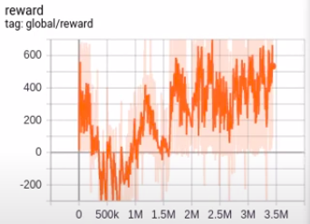

# Agente Rainbow aplicado a Super Mario World

AVISO: A restauração do treinamento não está funcionando corretamente. Isso implica que após o agente treinar 3~10 milhões de vezes é possível testar e registrar o aprendizado na primeira tentativa subsequente. 

Instruções de Uso: 
 
Copiar `data.json` juntamente ao diretório onde se encontra rom.sfc

É necessário alterar o caminho contido no arquivo checkpoint localizado no diretório results. (opcional)
Ex: `model_checkpoint_path: "<caminho completo>/results/model-3240382"`

O processo de treinamento funciona corretamente. Todavia, a escala para melhoria do agente é muito grande (ordem de, no mínimo, centena de milhares). 
`./treino [--restore]`

Há um problema na restauração das redes treinadas. Infelizmente não consegui corrigir o erro.
`./play [--restore]`

A evolução do agente durante o treino mais longo pode ser visto utilizando:
`tensorboard --logdir=results/18-04-2021_14-20-45/`

## Áudio

https://open.spotify.com/episode/5RAF101laLHhjPoOihI0iO
